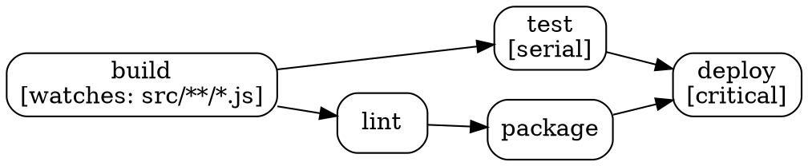

# Yam++ Roadmap & TODO Analysis

## 📊 Current Status (v0.8.2)
- ✅ **Core System**: Complete with internal functions, file watching, parameters
- ✅ **Ecosystem**: Full IDE support (VS Code, IntelliJ) + AI translator  
- ✅ **Architecture**: Strategy pattern, extensible, production-ready
- ✅ **Claude Code Interface**: Professional output system with real-time task blocks
- ✅ **Cross-Platform Revolution**: Native shell execution with cooperative control
- 🔧 **Critical Fixes**: Variable scope and parameter passing issues completely resolved (v0.8.2)

## ✅ Completed Items (can be archived)
- ~~Bug fixes (hanging processes)~~ → **RESOLVED** in v0.5.1 (stdio pipes fix)
- ~~Interactive input functions~~ → **COMPLETED** in v0.6.3-0.6.4 (4 input functions)
- ~~Dry-run functionality~~ → **IMPLEMENTED** in v0.5.1 (`--dry-run` flag)
- ~~Environment variables~~ → **PARTIALLY DONE** (env syntax exists, runtime evaluation)
- ~~**Claude Code Interface Output**~~ → **🎉 COMPLETED** in v0.7.0 (Professional interface with real-time task blocks)
- ~~**🚀 Cross-Platform Shell Execution**~~ → **🌟 COMPLETED** in v0.8.0 (THE GAME CHANGER - Revolutionary cooperative control system)
- ~~**🔧 Critical Variable Scope Bugs**~~ → **✅ RESOLVED** in v0.8.2 (Internal function variables now properly available to shell, parameter passing fixed)

## 🎯 Priority Analysis (Effort vs Impact)

| Feature | Effort | Impact | Score | Phase |
|---------|--------|--------|-------|-------|
| ~~**🎉 Claude Code Interface Output**~~ | ~~Medium~~ | ~~Very High~~ | ~~🌟 10/10~~ | **✅ v0.7.0** |
| ~~**🚀 Cross-Platform Shell Execution**~~ | ~~High~~ | ~~**GAME CHANGER**~~ | ~~🌟 **11/10**~~ | **✅ v0.8.0** |
| **Force Flag (--force)** ⭐ | Very Low | High | 🔥 **9.5/10** | v0.8.3 |
| **Continue Flag (--continue)** ⭐ | Very Low | High | 🔥 **9/10** | v0.8.3 |
| **Watch Mode (--watch)** ⭐ | Low | Very High | 🔥 **10/10** | v0.8.3 |
| **Include/Import System** | Medium | High | 🥇 9/10 | v0.8.3 |
| **Rollback System** ⭐ | Medium | Very High | 🔥 9.5/10 | v0.9.0 |
| **Hook System (before/after)** | Medium | High | 🥈 8.5/10 | v0.9.0 |
| **File I/O Internal Functions** | Low | Medium | 🥉 8/10 | v0.8.3 |
| **Plugin System Architecture** | High | Very High | 🔥 **9.5/10** | v0.9.0 |
| **Native Makefile Support** | Medium | Medium | 6/10 | v1.0.0 |
| **Remote Task Execution** ⭐ | High | Very High | 🔥 9/10 | v0.9.0 |
| **Execution Profiles** ⭐ | Low | High | 🥇 8.5/10 | v0.8.4 |
| **Enhanced Dry-Run** ⭐ | Low | Medium | 🥈 8/10 | v0.8.3 |
| **Dependency Graph (--graph)** ⭐ | Low | High | 🥇 8.5/10 | v0.8.3 |
| **Shell Autocomplete** ⭐ | Medium | Medium | 7/10 | v0.8.4 |
| **Secrets Management** ⭐ | Medium | High | 🥈 8/10 | v0.9.0 |

## 📝 Original TODO/Ideas List

### 🎉 HIGH PRIORITY COMPLETED ✅

- [x] ~~**Claude Code Interface Output System**~~ ⭐ **COMPLETED v0.7.0** ⭐
  - ✅ Replicated Claude Code's task execution interface perfectly
  - ✅ Task blocks with animated spinner during execution
  - ✅ Smart output display (max 6 lines with intelligent truncation)
  - ✅ Real-time timer showing duration [2.3s]
  - ✅ **MULTI-TASK SUPPORT**: Multiple blocks simultaneously for parallel tasks
  - ✅ Clean vertical layout with flicker-free updates
  - ✅ Live real-time updates with professional animations
  - ✅ **Intelligent Collapse**: Success → single line, Failed → full debug output
  - ✅ Enhanced error reporting with specific command details
  - ✅ Professional typography with emojis, bold text, color coding
  - ✅ Maintained --ugly mode as alternative (backward compatibility)

### ✅ HISTORIC MILESTONE COMPLETED - Cross-Platform Revolution (v0.8.0)

- [x] ~~**Cross-Platform Shell Execution**~~ **🌟 COMPLETED** ⭐ **GAME CHANGER** ⭐
  - ✅ **Platform Annotations**: `@linux @mac { }`, `@windows { }` syntax implemented
  - ✅ **Native Shell Integration**: Full bash/PowerShell/cmd execution within tasks
  - ✅ **Cooperative Control System**: Revolutionary bidirectional communication between shell and internal functions
  - ✅ **Variable Interoperability**: Shell variables accessible to internal functions, vice versa
  - ✅ **Backward Compatibility**: All existing simple commands continue working unchanged
  - ✅ **Multi-Platform Support**: One Yamfile runs optimally on Windows, Mac, Linux
  - ✅ **Native Power**: Full shell capabilities (for loops, functions, conditionals) + yampp enhancements
  - ✅ **Market Leadership**: THE unique cross-platform task runner with native shell power

### ✅ CRITICAL STABILITY MILESTONE - Production Ready (v0.8.2)

- [x] ~~**Critical Variable Scope Fixes**~~ **🔧 COMPLETED** ⭐ **PRODUCTION STABILITY** ⭐
  - ✅ **Variable Flow Resolution**: Fixed variables from `__input` not available to subsequent bash commands
  - ✅ **Parameter Passing**: Fixed task parameters not correctly passed to parametrized tasks in all contexts  
  - ✅ **Loop Context Support**: Fixed variable scope issues when `__call`/internal functions used inside loops
  - ✅ **Inline Intercept Architecture**: Replaced bash proxy functions with inline intercept code for proper scope
  - ✅ **Cross-Platform Consistency**: Both bash (tested ✅) and PowerShell (implemented ⚠️) use same architecture
  - ✅ **Backward Compatibility**: Zero breaking changes, all existing yamfiles continue working
  - ✅ **Production Stability**: Cooperative control system now 100% reliable for enterprise use

#### ✅ Technical Implementation Completed:
- ✅ **Parser Enhancement**: Peggy grammar for platform annotations and raw code blocks
- ✅ **Platform Detection**: Runtime OS detection with Strategy pattern (`linux`/`darwin`/`win32`)  
- ✅ **Task Filtering**: Execute tasks without tags + matching platform tags
- ✅ **Shell Execution**: Raw code pass-through with cooperative control system
- ✅ **Proxy Injection**: Shell function proxies for seamless internal function integration
- ✅ **State Synchronization**: Bidirectional variable sharing between shell and Yampp
- ✅ **Error Handling**: Enhanced parser errors with line numbers and context

#### Syntax Examples:
```yamfile
// Runs everywhere (no platform tag)
setup {
    echo "Setting up project..."
    __input "Project name:" name
}

@linux @mac {
    deploy(server) {
        # Full bash power
        for host in $(cat servers.txt); do
            ssh $host "systemctl restart app"
            __call notify_completion($host)
        done
    }
}

@windows {
    deploy(server) {
        # Full PowerShell power
        foreach ($host in Get-Content servers.txt) {
            Invoke-Command -ComputerName $host -ScriptBlock {
                Restart-Service "MyApp"
            }
            __call notify_completion($host)
        }
    }
}
```

### 🔧 Foundation Extensions (v0.8.3)

### Core Functionality
- [ ] **Force Flag (--force)** - Bypass cache and force task execution ⭐ **QUICK WIN** ⭐
  ```bash
  # Force task to run even if cached
  yampp --force build
  
  # Force all tasks in pipeline to run
  yampp --force build test deploy
  ```
  - **Very Low Effort**: Simple flag check to skip cache validation
  - **High Impact**: Essential for debugging and CI/CD workflows
  - **Implementation**: Check flag in StateManager.isTaskComplete()
  - **Estimated Time**: 30 minutes

- [ ] **Continue Flag (--continue/-k)** - Continue executing other tasks on error ⭐ **QUICK WIN** ⭐
  ```bash
  # Continue running other tasks even if one fails
  yampp --continue test1 test2 test3
  ```
  - **Very Low Effort**: Modify error handling in Runner.execute()
  - **High Impact**: Useful for test suites and CI/CD pipelines
  - **Implementation**: Add flag to Runner options and skip process.exit() on errors
  - **Estimated Time**: 45 minutes

**Note**: `--yes` flag is NOT needed because `--input key=value` already provides superior functionality:
```bash
# Instead of generic --yes, use specific overrides:
yampp deploy --input env=prod --input confirm=true
```
This approach is more explicit and safer than blanket auto-confirmation.

- [ ] **Watch Mode (--watch)** - Continuous execution with intelligent file watching ⭐ **NEW IDEA** ⭐
  ```bash
  # Runs initially, then watches for changes and re-executes intelligently
  yampp build test --watch
  
  # When src/app.js changes → build → test (smart dependency flow)
  # When test/app.test.js changes → test only
  ```
  - **Foundation Ready**: Leverages existing FileWatcher infrastructure
  - **Intelligent Execution**: Only runs affected tasks based on dependency tree  
  - **Developer Productivity**: Automatic rebuild/retest workflow
  - **Professional UX**: Real-time updates with Claude Code interface
- [ ] **Include/Import System** - Spread code across multiple files (`include "file.yamfile"`)
- [ ] **Plugin System** - Extensible architecture for custom functionality
- [ ] **Hook System** - before/after methods, beforeAll/afterAll with smart execution
- [ ] **Rollback System** - Automatic failure recovery for critical operations ⭐ **NEW IDEA** ⭐
  ```yamfile
  # Rollback tasks execute ONLY when the specified critical task fails
  rollback restore_database after database_migration { 
      echo "🚨 Migration failed! Rolling back..."
      mysql -u root mydb < backup.sql 
  }
  
  rollback cleanup_deployment after deploy { 
      kubectl rollout undo deployment/myapp
      __call notify_team("Deployment failed, rolled back")
  }
  ```
  - **Safety Net**: Automatic cleanup when critical operations fail
  - **Enterprise Ready**: Essential for production deployments
  - **Smart Execution**: Only runs on failure of associated task
  - **Integration**: Works with cooperative control system and internal functions
- [ ] **Cross-Platform Execution** - Native shell execution (Windows/Mac/Linux)
  - Options: Platform annotations (@linux, @mac, @windows)
  - Alternative: Separate files per platform with auto-detection
  - Alternative: Universal interpreter/wrapper
- [ ] **Native Makefile Support** - Direct Makefile execution without translation
  - Ideal: `yampp --makefile Makefile` runs with full yampp features

### Internal Functions Extensions
- [ ] **File I/O Functions** - Create, read, write file operations
  - `__read_file`, `__write_file`, `__exists`, `__copy`, `__move`

## 💡 New Feature Ideas (Added in Analysis)

### 🚀 BRILLIANT NEW IDEA - Watch Mode ⭐

**Concept**: Continuous execution with intelligent file watching
```bash
# Runs initially, then stays watching for file changes
yampp build --watch

# Only watches specific tasks  
yampp test lint --watch

# Combines with other flags
yampp build --watch --verbose
```

**Smart Behavior:**
```yamfile
# These tasks have file watching defined
build watches "src/**/*.js" {
    webpack --mode production
}

test watches "src/**/*.js" "test/**/*.test.js" {
    jest --passWithNoTests
}

deploy needs build test {
    kubectl apply -f deployment.yml
}
```

**Execution Flow:**
1. **Initial Run**: Executes requested tasks normally
2. **Watch Setup**: Monitors all files from `watches` declarations in the task tree
3. **Change Detection**: When files change, determines which tasks are affected
4. **Smart Re-execution**: Runs from the affected task forward (respects dependencies)
5. **Live Updates**: Uses Claude Code interface with real-time task blocks

**Example Flow:**
```bash
yampp deploy --watch

# Initial: build → test → deploy (all run)
# src/app.js changes → build → test → deploy (build triggered, flows through)
# test/app.test.js changes → test → deploy (test triggered, flows through)  
# deployment.yml changes → deploy (only deploy runs)
```

**Why This Is Brilliant:**
- 🔄 **Developer Productivity**: Automatic rebuild/retest on changes
- 🎯 **Intelligent**: Only runs what's needed based on dependency tree
- ⚡ **Performance**: Leverages existing file watching infrastructure
- 🖥️ **Great UX**: Live updates with professional interface
- 🛠️ **Universal**: Works with any task that has `watches` declaration

**Technical Implementation:**
- ✅ **Foundation Exists**: FileWatcher system already implemented
- 🔧 **Easy Extension**: Add `--watch` flag and continuous loop
- 🎨 **UI Enhancement**: Real-time task updates in watch mode
- 🧠 **Smart Logic**: Task tree analysis for minimal re-execution

**Real-World Use Cases:**
- Frontend development with automatic build/reload
- Test-driven development with continuous testing  
- API development with automatic restart
- Documentation generation on content changes
- Docker image rebuilds on Dockerfile changes

### 🔥 BRILLIANT NEW IDEA - Rollback System ⭐

**Concept**: Automatic failure recovery for critical operations
```yamfile
rollback restore_database after database_migration { 
    echo "🚨 Migration failed! Rolling back..."
    mysql -u root mydb < backup.sql 
    __call notify_team("Database migration failed, restored from backup")
}

critical: database_migration {
    echo "📊 Starting critical database migration..."
    mysql -u root mydb < migration.sql
}

# Flow: If database_migration FAILS → restore_database runs automatically
# Flow: If database_migration SUCCEEDS → restore_database never runs
```

**Why This Is Brilliant:**
- 🛡️ **Safety First**: Automatic cleanup prevents system corruption
- 🏭 **Production Ready**: Essential for enterprise deployments  
- 🎯 **Precise Control**: Only runs on failure, not success
- 🔄 **Integrates Perfectly**: Works with cooperative control + internal functions
- 📈 **High Impact**: Solves major pain point in deployment automation
- 🚀 **Competitive Advantage**: No other task runner has this built-in

**Real-World Use Cases:**
- Database migrations with automatic restore
- Kubernetes deployments with auto rollback
- File system operations with cleanup
- Service deployments with previous version restore
- Infrastructure changes with state restoration

**Technical Implementation Path:**
1. First implement Hook System (before/after/beforeAll/afterAll)
2. Extend with `rollback` modifier that attaches to task failure events
3. Integrate with cooperative control for rich error handling
4. Add rollback tracking to prevent infinite loops

### Quick Wins (High Impact, Low Effort)
- [ ] **Conditional Execution** - `if/unless` keywords for conditional tasks
  ```yamfile
  if $ENV == "prod": deploy { ... }
  ```
- [ ] **Loop/Iteration Support** - Process multiple items
  ```yamfile
  for file in *.js: process($file) { ... }
  ```
- [ ] **Task Templates/Inheritance** - Reduce code duplication
  ```yamfile
  build.web extends build.base { ... }
  ```

### 🌐 NEW BRILLIANT IDEA - Remote Task Execution ⭐

**Concept**: Distributed task execution across worker pools
```yamfile
# Define worker pools
workers {
    compile_farm: ["worker1.domain.com", "worker2.domain.com", "worker3.domain.com"]
    test_runners: ["test1.local", "test2.local"]
}

# Option 1: Automatic distribution - Yampp decides which worker
distributed: compile_heavy watches "src/**/*.cpp" {
    # Yampp automatically selects least-loaded worker from default pool
    g++ -O3 heavy_computation.cpp -o output
    # Result/artifact automatically transferred back
}

# Option 2: Explicit remote execution within task
deploy {
    echo "Building locally..."
    __remote compile_farm[0] {
        docker build -t myapp:latest .
        docker save myapp:latest -o /tmp/image.tar
    }
    # Artifact automatically synced back
    docker load -i image.tar
    kubectl apply -f deployment.yaml
}

# Option 3: Task with explicit pool assignment
pool compile_farm: distributed_build {
    make -j8 all
}
```

**Why This Is Brilliant:**
- 🚀 **Scalability**: Distribute heavy workloads across multiple machines
- ⚡ **Performance**: Parallel execution on dedicated hardware
- 🏭 **CI/CD Integration**: Natural fit for build farms and test grids
- 💼 **Enterprise Ready**: Essential for large-scale deployments
- 🎯 **Smart Load Balancing**: Automatic worker selection based on load
- 📦 **Artifact Management**: Automatic result/file transfer

**Real-World Use Cases:**
- Distributed compilation for large C++ projects
- Parallel test execution across multiple machines
- Docker image building on dedicated servers
- Machine learning model training on GPU clusters
- Cross-platform builds (Windows/Mac/Linux simultaneously)

### 📊 NEW IDEA - Enhanced Dry-Run Output ⭐

**Concept**: Comprehensive simulation with detailed analysis
```bash
yampp deploy --dry-run

📋 Dry-Run Analysis for 'deploy'
================================

🎯 Tasks to Execute:
  ✓ build (cached - up to date)
  → test (will run - dependencies changed)
  → package (will run - follows test)
  → deploy (will run - target task)

📁 File Status:
  ✓ dist/app.js - up to date (matches src/**/*.js watches)
  ⚠ dist/styles.css - outdated (src/main.scss modified)
  ✓ docker/Dockerfile - up to date

🔄 Rollback Definitions:
  ⚠ deploy → rollback: restore_previous_deployment
  ⚠ database_migration → rollback: restore_database_backup

⏱️ Estimated Time: ~3m 45s (based on historical data)

💡 Optimization Suggestions:
  - 'test' could run in parallel with 'lint' (save ~45s)
  - Consider caching node_modules (save ~1m 20s)
```

**Why This Is Useful:**
- 🎯 **Complete Visibility**: See exactly what will happen before execution
- 📊 **Impact Analysis**: Understand which files trigger which tasks
- 🛡️ **Risk Assessment**: See rollback safety nets before critical operations
- ⏱️ **Time Estimation**: Plan based on expected duration
- 💡 **Optimization Hints**: Discover parallelization opportunities

### 📈 NEW IDEA - Dependency Graph Visualization (--graph) ⭐

**Concept**: ASCII/Graphviz visualization of task dependencies
```bash
# ASCII output to console
yampp --graph

build ──┬──→ test ───→ deploy
        │
        └──→ lint ───→ package

# Export to Graphviz DOT format
yampp --graph --format dot > tasks.dot
dot -Tpng tasks.dot -o tasks.png

# Interactive HTML output
yampp --graph --format html > tasks.html
```

**Example DOT Output:**


**Why This Is Valuable:**
- 🎨 **Visual Understanding**: See complex dependency trees at a glance
- 🔍 **Bottleneck Detection**: Identify parallelization opportunities
- 📚 **Documentation**: Auto-generate project flow diagrams
- 🎯 **Optimization**: Spot unnecessary dependencies
- 🏢 **Team Communication**: Share build flow with stakeholders

### 🔐 NEW IDEA - Secrets Management Integration ⭐

**Concept**: Secure credential handling with popular secret managers
```yamfile
# Integration with various secret managers
secrets {
    provider: "chamber"  # or: vault, aws-sm, 1password, doppler
    service: "myapp/prod"
}

deploy {
    # Secrets automatically injected as environment variables
    __secret "database_password" as DB_PASS
    __secret "api_key" as API_KEY
    
    # Or use with secret manager directly
    chamber exec myapp/prod -- deploy.sh
    
    # Explicit secret retrieval
    password=$(__secret_get "database_password")
    mysql -u admin -p$password < migration.sql
}
```

**Why This Is Critical:**
- 🔒 **Security**: Never commit secrets to repository
- 🏢 **Enterprise Standard**: Integrates with existing secret infrastructure
- 🔄 **Rotation Support**: Automatic secret refresh
- 🎯 **Environment Specific**: Different secrets per environment
- 📋 **Audit Trail**: Track secret access for compliance

**Supported Providers:**
- HashiCorp Vault
- AWS Secrets Manager / Parameter Store
- Chamber (Segment)
- 1Password CLI
- Doppler
- Azure Key Vault

### 👤 NEW IDEA - Execution Profiles ⭐

**Concept**: Environment-specific configurations
```yamfile
# .yampp/profiles.yaml
profiles:
  dev:
    variables:
      LOG_LEVEL: "debug"
      API_URL: "http://localhost:3000"
    workers: ["localhost"]
    flags:
      verbose: true
      parallel: 2
  
  staging:
    variables:
      LOG_LEVEL: "info"
      API_URL: "https://staging.api.com"
    workers: ["staging-worker-1", "staging-worker-2"]
    flags:
      quiet: false
      parallel: 4
  
  production:
    variables:
      LOG_LEVEL: "error"
      API_URL: "https://api.production.com"
    workers: ["prod-worker-1", "prod-worker-2", "prod-worker-3"]
    flags:
      quiet: true
      parallel: 8
    secrets:
      provider: "vault"
      path: "secret/production"
```

**Usage:**
```bash
# Activate profile
yampp --profile production deploy

# Or via environment
YAMPP_PROFILE=staging yampp test

# Override profile settings
yampp --profile dev --parallel 4 build
```

**Why This Is Powerful:**
- 🎭 **Environment Consistency**: Same commands, different configs
- 🚀 **Quick Switching**: Change entire setup with one flag
- 📋 **Configuration as Code**: Version controlled settings
- 🔧 **Override Capability**: Profile + command-line flexibility
- 🏢 **Team Alignment**: Shared configurations across team

### 🚀 NEW IDEA - Shell Autocomplete ⭐

**Concept**: Intelligent command-line completion
```bash
# Install completion
yampp --install-completion bash  # or: zsh, fish, powershell

# Then use:
yampp dep[TAB]
# Suggests: deploy, deploy_staging, deploy_production

yampp --pr[TAB]
# Suggests: --profile, --plan

yampp build --[TAB]
# Suggests: --verbose, --quiet, --dry-run, --watch, --profile

# Task parameter completion
yampp deploy:[TAB]
# Suggests: staging, production (from past usage)
```

**Implementation:**
- Bash: completion script in `/etc/bash_completion.d/`
- Zsh: completion in `$fpath`
- Fish: completion in `~/.config/fish/completions/`
- PowerShell: Register-ArgumentCompleter

**Why This Improves UX:**
- ⚡ **Faster Development**: No need to remember exact task names
- 🎯 **Discovery**: Find available tasks and options easily
- 📚 **Self-Documenting**: Learn CLI options through exploration
- 🔄 **Context Aware**: Suggestions based on current Yamfile
- 💼 **Professional Feel**: Expected feature in modern CLIs

### 🔌 CRITICAL IDEA - Plugin System Architecture ⭐⭐⭐

**Concept**: Extensible ecosystem for third-party functionality
```yamfile
# .yampp/plugins.yaml
plugins:
  - yampp-docker@1.2.0
  - yampp-aws@2.0.1
  - yampp-kubernetes@1.5.0
  - ./local-plugins/my-company-plugin
  - github:mycompany/yampp-custom-plugin

# Usage in Yamfile
plugins {
    docker: "yampp-docker"
    aws: "yampp-aws"
    k8s: "yampp-kubernetes"
}

deploy {
    # Docker plugin provides new internal functions
    __docker_build "myapp:latest" "./Dockerfile"
    __docker_push "registry.company.com/myapp:latest"
    
    # AWS plugin functions
    __aws_s3_upload "./dist" "s3://my-bucket/releases/"
    __aws_ecs_deploy "my-service" "myapp:latest"
    
    # Kubernetes plugin
    __k8s_apply "./k8s/deployment.yaml"
    __k8s_wait_ready "deployment/myapp" --timeout 300
    
    # Git plugin (community)
    __git_tag "v$VERSION"
    __git_push_tags
}

# Plugins can also provide new task modifiers
docker_cached: build_image {
    # Plugin adds caching layer awareness
    docker build --cache-from registry/cache .
}

# And new task types
aws_lambda: process_data {
    handler: "index.handler"
    runtime: "nodejs18.x"
    memory: 512
    timeout: 30
}
```

**Plugin Structure:**
```javascript
// yampp-docker/index.js
export default class DockerPlugin {
    // Metadata
    static metadata = {
        name: 'yampp-docker',
        version: '1.2.0',
        description: 'Docker integration for Yampp',
        author: 'community'
    }
    
    // Register internal functions
    registerFunctions() {
        return {
            '__docker_build': this.dockerBuild.bind(this),
            '__docker_push': this.dockerPush.bind(this),
            '__docker_compose': this.dockerCompose.bind(this)
        }
    }
    
    // Register task modifiers
    registerModifiers() {
        return {
            'docker_cached': this.dockerCachedModifier,
            'docker_multi_stage': this.multiStageModifier
        }
    }
    
    // Implementation
    async dockerBuild(context, imageName, dockerfile = '.') {
        const { runner, logger, state } = context
        await runner.executeCommand(`docker build -t ${imageName} ${dockerfile}`)
        state.set(`docker.images.${imageName}`, Date.now())
    }
}
```

**Plugin Package Structure:**
```
yampp-docker/
├── package.json         # NPM package with "yampp-plugin" keyword
├── index.js            # Main plugin class
├── lib/
│   ├── functions/      # Internal function implementations
│   ├── modifiers/      # Task modifier implementations
│   └── validators/     # Custom validation rules
├── templates/          # Starter templates
│   ├── dockerfile.template
│   └── compose.template
└── docs/
    └── README.md
```

**Plugin Discovery & Installation:**
```bash
# Official registry
yampp plugins search docker
yampp plugins install yampp-docker

# From npm
npm install -g yampp-docker

# From GitHub
yampp plugins install github:user/yampp-myplugin

# Local development
yampp plugins link ./my-local-plugin
```

**Why This Is GAME-CHANGING:**
- 🌍 **Ecosystem Growth**: Community can extend without forking
- 🔧 **Tool Integration**: Wrap any CLI tool as Yampp functions
- 🏢 **Enterprise Customization**: Companies create internal plugins
- 📦 **Modular Architecture**: Core stays lean, features via plugins
- 🚀 **Innovation Speed**: Parallel development by community
- 💎 **Best Practices**: Plugins can encapsulate workflows

**Real-World Plugin Examples:**

**yampp-docker:**
- `__docker_build`, `__docker_push`, `__docker_tag`
- `__docker_compose_up`, `__docker_compose_down`
- Multi-stage build optimization
- Cache management

**yampp-aws:**
- `__aws_s3_sync`, `__aws_cloudfront_invalidate`
- `__aws_lambda_deploy`, `__aws_ecs_update`
- `__aws_secrets_get`, `__aws_parameter_store`
- CloudFormation/CDK integration

**yampp-kubernetes:**
- `__k8s_deploy`, `__k8s_rollback`
- `__helm_install`, `__helm_upgrade`
- `__k8s_secret_create`, `__k8s_configmap`
- Blue-green deployment strategies

**yampp-git:**
- `__git_commit`, `__git_push`, `__git_tag`
- `__git_branch_create`, `__git_merge`
- `__github_release`, `__gitlab_mr`
- Conventional commits enforcement

**yampp-nodejs:**
- `__npm_version`, `__npm_publish`
- `__yarn_workspace`, `__pnpm_recursive`
- `__node_modules_cache`, `__lockfile_check`
- Monorepo support

**yampp-python:**
- `__pip_install`, `__poetry_build`
- `__pytest_run`, `__black_format`
- `__venv_create`, `__requirements_freeze`
- Virtual environment management

**yampp-terraform:**
- `__terraform_plan`, `__terraform_apply`
- `__terraform_workspace`, `__terraform_output`
- State management and locking
- Multi-environment support

**Plugin Marketplace Vision:**
```bash
# Browse official plugins
yampp plugins browse

┌─────────────────────────────────────────────────────┐
│ Yampp Plugin Marketplace                           │
├─────────────────────────────────────────────────────┤
│ ⭐ yampp-docker (10.2k downloads)                  │
│    Docker integration with caching                 │
│                                                     │
│ ⭐ yampp-aws (8.5k downloads)                      │
│    AWS services integration (S3, ECS, Lambda)      │
│                                                     │
│ ⭐ yampp-kubernetes (7.1k downloads)               │
│    K8s deployments with Helm support              │
│                                                     │
│ 🆕 yampp-rust (450 downloads)                      │
│    Cargo build optimization and caching            │
└─────────────────────────────────────────────────────┘
```

**Technical Implementation Strategy:**
1. **Plugin API**: Define stable public API for plugins
2. **Sandbox Execution**: Plugins run in controlled environment
3. **Version Management**: Handle plugin dependencies and conflicts
4. **Discovery Protocol**: Registry API for finding plugins
5. **Security**: Plugin signing and verification
6. **Performance**: Lazy loading, only load used plugins

**Why Higher Priority Than Initially Scored:**
- **Ecosystem Effect**: Accelerates adoption exponentially
- **Community Driven**: Offloads feature development
- **Enterprise Ready**: Companies need custom integrations
- **Competitive Moat**: Rich plugin ecosystem is hard to replicate
- **Future Proof**: New tools automatically supported via plugins

### Metrics & Observability
- [ ] **Built-in Performance Metrics** - Task timing, bottleneck detection
- [ ] **Success/Failure Tracking** - JSON output for CI/CD integration
- [ ] **Dependency Analysis** - Visual dependency graphs and optimization

### Developer Experience
- [ ] **Configuration File Support** - `.yamprc` for default settings
- [ ] **Task Aliases/Shortcuts** - `alias b = build`, quick command shortcuts
- [ ] **Enhanced Error Messages** - Better diagnostics and suggestions
- [ ] **Task Documentation** - Built-in help system for tasks

## 🛣️ Recommended Roadmap

### ✅ Phase 0: UX Revolution (v0.7.0) - COMPLETED ✅
**Goal**: Professional output interface matching modern standards
1. ✅ **Claude Code Interface Output** - Multi-task parallel display
2. ✅ **Clean Visual Design** - Spinners, timers, truncated output  
3. ✅ **Real-time Updates** - Live streaming for all running tasks
4. ✅ **Maintain ugly mode** - Keep as alternative output option

**🎉 COMPLETED**: Professional interface that rivals Docker, npm, yarn
**Result**: Transformed Yampp from amateur to professional-grade UX

### Phase 1: Foundation (v0.7.1) - Quick Wins
**Goal**: Enable modular development and better observability
1. 🎯 **Include/Import System** - Foundation for modular Yamfiles
2. 🔧 **File I/O Internal Functions** - `__read_file`, `__write_file`, `__exists`
3. 📊 **Built-in Metrics** - Performance tracking and timing
4. ⚙️ **Configuration File** - `.yamprc` for project defaults

**Estimated Effort**: 2-3 weeks | **Impact**: High

### Phase 2: Core Extensions (v0.8.0)
**Goal**: Advanced task control and execution logic
1. 🪝 **Hook System** - before/after/beforeAll/afterAll
2. 🔀 **Conditional Execution** - if/unless keywords
3. 🏷️ **Task Aliases** - Shortcuts and improved UX
4. 📈 **Enhanced Metrics** - Success/failure tracking, JSON output

**Estimated Effort**: 3-4 weeks | **Impact**: High

### Phase 3: Advanced Features (v0.9.0)
**Goal**: Extensibility and ecosystem growth
1. 🔌 **Plugin System Architecture** - Extensibility framework
2. 🔄 **Loop/Iteration Support** - for/while constructs
3. 📦 **Native Makefile Support** - Direct Makefile execution
4. 🧩 **Task Templates** - Inheritance and composition

**Estimated Effort**: 4-6 weeks | **Impact**: Very High

### Phase 4: Enterprise Ready (v1.0.0)
**Goal**: Production-grade, cross-platform support
1. 🌐 **Cross-Platform Execution** - Windows/Mac/Linux native
2. 📊 **Advanced Observability** - Dashboards, analytics
3. 🎯 **Performance Optimization** - Caching, parallelization improvements
4. 📚 **Comprehensive Documentation** - API docs, tutorials, examples

**Estimated Effort**: 6-8 weeks | **Impact**: Very High

## 🏆 Next Action Item

**RECOMMENDATION**: Start with **Include/Import System** in v0.8.3

**Why this choice?**
- 🔧 **Foundation for Modularity**: Essential for large projects and code organization
- 📈 **High Impact, Medium Effort**: Great ROI for development effort
- 🏗️ **Enables Complex Projects**: Allows spreading code across multiple files
- 💼 **Enterprise Ready**: Critical for team development and maintainable codebases
- ✨ **Natural Next Step**: Builds on the solid, stable cross-platform foundation
- 🚀 **Quick Win**: Can deliver significant value in shorter timeframe

**Strategic Value After v0.8.2 Production Stability:**
- **Make**: Powerful but Unix-only, no include system, basic variables ❌
- **Just/Gradle**: Cross-platform but limited modularity, no cooperative control ❌
- **Yampp v0.8.2**: Cross-platform + Native shell power + Modern UX + Cooperative control + Production stable ✅
- **Yampp v0.8.3**: All above + Modularity = **COMPLETE SOLUTION** 🎯

**Historic Achievements**: 
- ✅ Cross-Platform Shell Execution (v0.8.0) - THE GAME CHANGER
- ✅ Production Stability (v0.8.2) - CRITICAL FIXES COMPLETED

**Implementation Approach**:
```yamfile
# main.yamfile
include "common/database.yamfile"
include "./deployment/staging.yamfile" 
include "../shared/utilities.yamfile"

# Relative paths, recursive includes, cycle detection
```

---

## 📋 Development Notes

**Best Practices Established:**
- All new features should maintain backward compatibility
- Internal functions use Strategy pattern architecture
- Documentation must be updated with each feature
- IDE extensions should be synchronized with core features
- Professional git commits without AI tool references

**Quality Gates:**
- [ ] Comprehensive testing with examples
- [ ] Updated documentation (README, CHANGELOG)
- [ ] IDE extension synchronization
- [ ] Performance impact assessment
- [ ] Breaking change analysis

---

*This TODO.md is actively maintained and reflects current project priorities based on technical analysis and user impact assessment.*